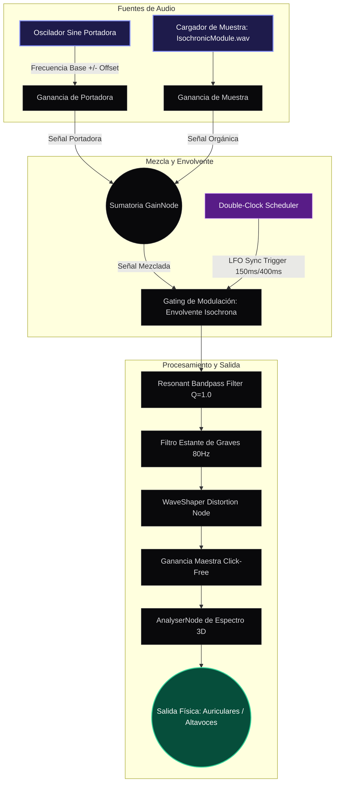

# 🧠 Neuro-Sync Engine (v1.2.0)
### Plataforma Modular de Síntesis Neuroacústica Avanzada y Entrenamiento Cerebral

El **Neuro-Sync Engine** es un sofisticado entorno de síntesis de audio digital diseñado para el arrastre cerebral (*brainwave entrainment*) y la inducción de estados cognitivos profundos. Fusionando generadores de ondas binaurales de alta fidelidad con un secuenciador de pulsos isocrónicos híbridos (fuentes sintéticas y muestras orgánicas), la plataforma provee una experiencia clínica y envolvente envuelta en una interfaz interactiva de estética *iridiscente y glassmorphic*.

Desarrollado como una aplicación web moderna de Next.js y empaquetado para escritorio mediante Electron, el motor utiliza procesamiento en tiempo real con la **Web Audio API** y visualizaciones procedimentales aceleradas por GPU a través de **Three.js/GLSL Shaders**.

---

## 📺 Demostración de la Interfaz

Aquí puede apreciarse la aplicación en funcionamiento, mostrando el visualizador espectral Aurora 3D acoplado al motor de síntesis, los controles interactivos de audio y el HUD de iluminación dinámica:


---

## 🚀 Arquitectura y Pilares Tecnológicos

### 1. Programador Híbrido Isobrónico (The "Two Clocks" System)
A diferencia de los enfoques tradicionales basados en LFO de baja resolución, nuestro motor implementa un secuenciador de doble reloj con técnica de anticipación (*lookahead scheduler*) que opera a microsegundos de precisión:
*   **Sincronización de Fase Bloqueada:** Sincroniza al milisegundo osciladores digitales con muestras orgánicas cargadas estáticamente (`/public/IsochronicModule.wav`).
*   **Envolventes Etéreas (Ethereal Envelopes):** Con rampas suavizadas de **150ms de ataque** y **400ms de caída** para atenuar transitorios abruptos, eliminando clics digitales sin perder el empuje rítmico.
*   **Compensación de Curvas Fletcher-Munson:** Aplica filtros adaptativos basados en contornos de igual sonoridad (ISO 226:2003) para compensar la sensibilidad auditiva en portadoras extremas y prevenir la fatiga coclear.
*   **Atenuación Espectral Dinámica:** Balancea la salida atenuando frecuencias Delta (-35%) e impulsando frecuencias de alto rendimiento como Gamma (+40%) para lograr una sonoridad autopercibida homogénea.

### 2. Generador Binaural y Portadoras de Resonancia Solfeggio
Generación de ondas binaurales por desfase dichótico (audición separada por canal izquierdo y derecho) a partir de frecuencias puras mapeadas en la escala de resonancia Solfeggio:
*   **396 Hz (Ut):** Liberación de culpa y miedo.
*   **417 Hz (Re):** Facilitación del cambio y disolución de bloqueos.
*   **528 Hz (Mi):** Transformación y milagros (reparación bioenergética).
*   **639 Hz (Fa):** Conexión y relaciones interpersonales.
*   **741 Hz (Sol):** Despertar de la intuición y claridad mental.
*   **852 Hz (La):** Retorno al orden espiritual y autoconciencia.

### 3. Motor de Automatización Generativa por IA (Gemini 3.5)
Integración nativa con el SDK `@google/genai` y el modelo **Gemini 3.5 Flash** para construir prescripciones neuroacústicas personalizadas:
*   **API Psychoacoustic (`/api/psychoacoustic`):** Recibe la descripción de la intención del usuario y devuelve un esquema paramétrico estructurado (JSON estructurado estricto mediante `responseSchema`).
*   **Rampas Paramétricas Clínicas:** Genera un trayecto de entrenamiento de 180 segundos dividido en 6 fases de 30 segundos cada una, modulando la portadora base, el desplazamiento estático (`carrierOffset`), la amplitud del micro-LFO (`beatLfoAmplitude`) y la tasa de oscilación (`beatLfoRate`).

### 4. Visualizador Espectral Aurora 3D
Experiencia inmersiva en tiempo real construida sobre **React Three Fiber (R3F)** y **GLSL Shaders**:
*   **Deformación en Dominio de Tiempo:** Modulación física bidimensional de geometrías vectoriales basada en los valores capturados por el `AnalyserNode` de la Web Audio API.
*   **Auroras Procedimentales:** Shaders fragmentarios con paletas cromáticas que reaccionan a la frecuencia portadora y a la intensidad de pulso activa.
*   **Efecto SVG Grainient:** Filtro de turbulencia SVG de alto rendimiento que añade textura analógica y granulada a la interfaz interactiva.

### 5. Distribución de Escritorio Multiplataforma (Electron)
El proyecto incluye soporte completo para escritorio a través de Electron:
*   **Protocolo Personalizado `app://`:** Servidor interno ultraligero implementado en `electron-main.js` para extraer recursos estáticos de forma segura desde el directorio de exportación empaquetado en formato **ASAR**.
*   **Gestión SPA Avanzada:** Enrutamiento e hidratación automática sin dependencias externas para navegación fluida y offline.

---

## 📊 Diagrama del Flujo de Audio (Audio DSP Graph)

El siguiente diagrama detalla cómo se procesa, modula y mezcla la señal de audio antes de ser enviada a los transductores físicos del usuario:



---

## 🛠️ Requisitos e Instalación

### Requisitos Previos
*   **Node.js:** Versión 18 o superior.
*   **NPM:** Versión 9 o superior.
*   **Gemini API Key:** Opcional (requerido únicamente para la generación de sesiones inteligentes mediante IA). Guardar la clave en un archivo `.env` en la raíz del proyecto.

### 1. Clonar el Proyecto
```bash
git clone https://github.com/DanielDobles/Sonidos-Binaurales-Modulares.git
cd Sonidos-Binaurales-Modulares
```

### 2. Configurar Variables de Entorno
Crea un archivo `.env` o `.env.local` en la raíz y define tu clave de IA:
```env
GEMINI_API_KEY=tu_api_key_aqui
```

### 3. Instalar Dependencias
```bash
npm install
```

---

## ⚙️ Modos de Ejecución

### Versión Web (Next.js)

Para ejecutar y probar la aplicación directamente en tu navegador web local:

```bash
# Iniciar el servidor de desarrollo
npm run dev

# Compilar y generar la versión de producción optimizada
npm run build

# Iniciar el servidor local en producción
npm run start
```

### Versión de Escritorio (Electron)

Para ejecutar la aplicación interactiva dentro de una ventana de escritorio dedicada (Electron):

```bash
# Iniciar servidor web y la ventana de Electron concurrentemente
npm run electron-dev

# Compilar recursos de Next.js y empaquetar el instalador ejecutable (.exe / .dmg)
npm run electron-build
```

---

## 📂 Estructura del Directorio Principal

```markdown
├── app/                  # Estructura del ruteador Next.js (Rutas y Backend)
│   ├── api/              # Endpoints del backend
│   │   └── psychoacoustic/ # Generador de sesiones asistidas por IA (Gemini SDK)
│   ├── globals.css       # Estilos globales y tokens CSS de Tailwind CSS 4
│   ├── layout.tsx        # Contenedor principal de metadatos y fuentes
│   └── page.tsx          # Renderizado inicial del aplicativo
├── components/           # Componentes de UI reactivos y acelerados
│   ├── BinauralBeatsApp.tsx # Contenedor principal del HUD interactivo
│   ├── BorderGlow.tsx    # Bordes iluminados animados reactivos
│   ├── DarkVeil.tsx      # Fondo oscuro atmosférico con efectos de profundidad
│   └── Grainient.tsx     # Filtro SVG de textura analógica para estética táctil
├── lib/                  # Núcleo de computación lógica y síntesis
│   ├── IsochronicModule.ts  # Sintetizador híbrido isócrono (Web Audio API)
│   └── utils.ts          # Funciones auxiliares comunes
├── public/               # Recursos multimedia estáticos
│   └── IsochronicModule.wav # Muestra orgánica para el motor híbrido
├── electron-main.js      # Script del proceso principal de Electron (Offline app://)
└── package.json          # Script de automatización y control de dependencias
```

---

## 🧬 Fundamento Neuroacústico de Ondas Clínicas

El Neuro-Sync Engine opera limitando dinámicamente las fluctuaciones estocásticas estrictamente dentro de los rangos de ondas cerebrales validados clínicamente para evitar la sobreestimulación cognitiva o la distorsión auditiva:

| Rango de Onda | Rango Frecuencial | Estado Mental Inducido / Beneficios Clínicos |
| :--- | :--- | :--- |
| **Épsilon** | < 0.5 Hz | Meditación trascendental extremadamente profunda, sincronización cerebral global. |
| **Delta** | 0.5 Hz - 4.0 Hz | Sueño profundo libre de MOR (sueño delta), regeneración celular acelerada y liberación de hormona del crecimiento. |
| **Theta** | 4.0 Hz - 8.0 Hz | Estados hipnóticos, meditación profunda, acceso al subconsciente, sueños lúcidos y creatividad fluida. |
| **Alfa** | 8.0 Hz - 13.0 Hz | Alerta relajada, super-aprendizaje, reducción del cortisol y procesamiento visual en reposo. |
| **Beta** | 13.0 Hz - 30.0 Hz | Enfoque mental activo, resolución de problemas matemáticos, lógica lineal y estado de vigilia productivo. |
| **Gamma** | 30.0 Hz - 100.0 Hz | Procesamiento de alta velocidad cognitiva, consolidación de la memoria a largo plazo, insights e hiper-conciencia. |
| **Lambda** | 100.0 Hz - 200.0 Hz | Integración inter-hemisférica avanzada y experiencias perceptivas autorreguladas de alta coherencia. |

---

## 📜 Historial de Versiones

### [v1.2.0] (Actual)
*   **Audio "Blur" System:** Implementación de transiciones acústicas cinematográficas con atenuaciones graduales de **500ms al detener** y subidas cinemáticas de **4s al iniciar**.
*   **LFO Micro-Modulation:** Sincronización paramétrica en fase de LFOs aplicados dinámicamente a la portadora binaural e isocrónica.
*   **Esquema de IA v2.0:** Adaptación del tipado en el prompt y respuesta estructurada de Gemini incorporando `beatLfoAmplitude` y `beatLfoRate` para inducir modulaciones orgánicas.
*   **Suavizado de Pulso Isobrónico:** Incremento a **150ms de ataque** y **400ms de caída** para evitar cualquier sensación percusiva agresiva.
*   **Constreñimiento Clínico Estricto:** Ajustes algorítmicos para asegurar que la variación de frecuencia acumulada nunca rompa los límites espectrales del preset activo.

### [v1.1.0]
*   **Motor de Pulso Híbrido:** Introducción del scheduler en base a muestras de audio estáticas combinadas con oscilador senoidal.
*   **Equilibrio de Ganancia:** Integración de la compensación por frecuencia para Delta (-35%) y Gamma (+40%).
*   **Consistencia de Etiquetas:** Redireccionamiento estético unificando marcas y terminologías hacia "Binaural".

### [v1.0.0]
*   **Línea Base del DSP:** Arquitectura inicial de osciladores Web Audio API, selector de 6 tonos de resonancia Solfeggio, y control maestro de hardware volumen click-free.
*   **HUD Visual Aurora:** Renderizado espectral procedural Aurora en WebGL acoplado dinámicamente al sonido.

---

## 👨‍💻 Créditos e Ingeniería
*   **Daniel Dobles** - *DSP Sound Engineering, Web Audio API Architect & Premium UI/UX Design.*

---

*“El silencio es el lienzo; la frecuencia, el pincel que esculpe la mente.”*
